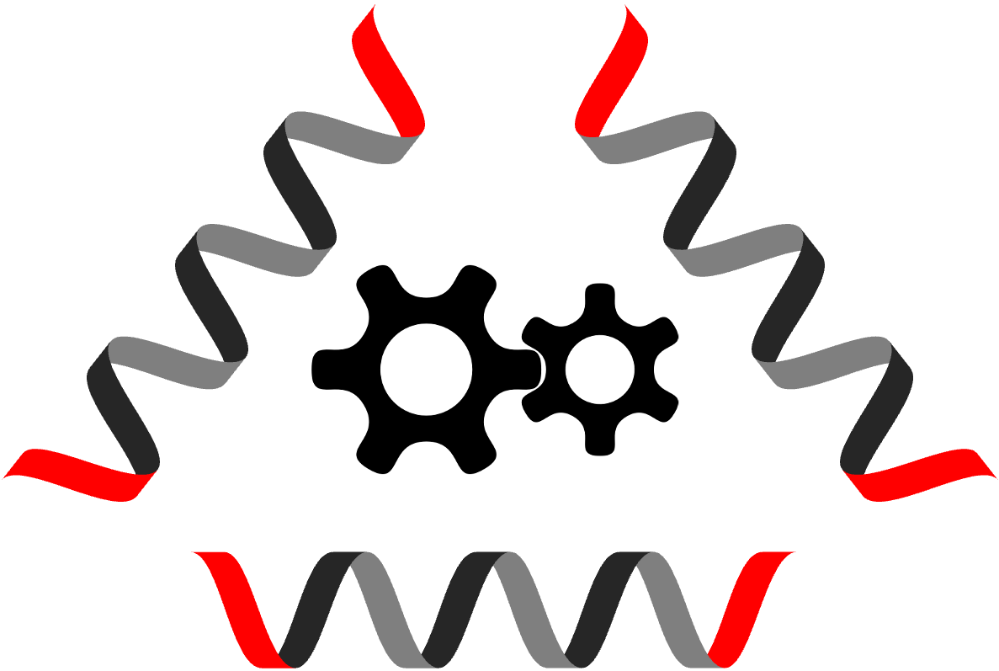
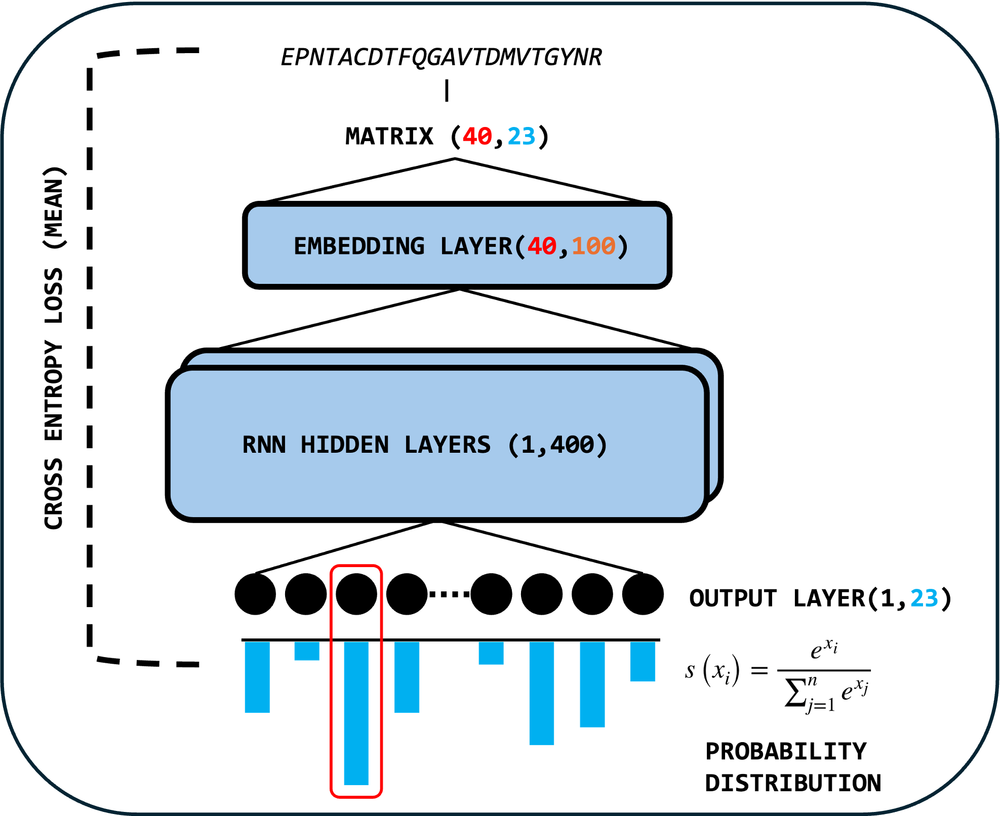
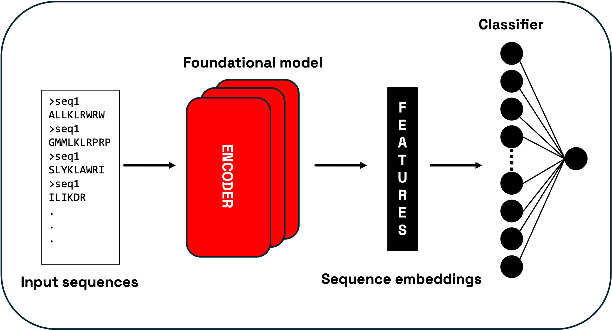

# ACP-designer

<p align="center">
  
</p>
<p align="center">
  
</p>

## Overview

**ACP-designer** is a ML-based toolbox for design of peptide-based anticancer therapeutic agents. Developed by CEITEC - [Robert Vacha group](https://vacha.ceitec.cz)

This toolbox enables rapid and cost-effective design of novel Mastoparan-like anticancer sequences. It contains simple generative model coupled with cytotoxicity filter to ensure seamless filtering for potential therapeutical candidates

---

## Features

1. **Generative model**

 
Small recurrent neural network trained on Anticaner peptide distribution and fine-tuned on Mastoparan peptides

2. **Cytotoxicity filter**

 
Cytotoxicity classifier is based on protein embeddings from [ESM2](https://www.science.org/doi/10.1126/science.ade2574) model with random forest regressor predicting toxicity probability. In results user will find three toxicity labels: LOW, MEDIUM and HIGH.

3. **additional filters**

Generated sequences are compared to training data in charge and hycrophobic moment distributions. Generated sequences are labeled as OK or EDGE. This serves as additional check to ensure that sequences with EDGE label may face wet-lab synthesis issues due to overall physiochemical unfeasibility.

---

## Installation

### Local Installation

1. **Clone the Repository**  
   ```bash
   git clone https://github.com/karatedava/ACP-designer.git
   cd ACP-designer
   ```
2. **Install Miniconda**  
   Download and install Miniconda by following the [official Miniconda installation guide](https://www.anaconda.com/docs/getting-started/miniconda/install#quickstart-install-instructions).

3. **Create a Conda Environment**  
   Create and activate a Python 3.12 environment:
   ```bash
   conda create -n acp_designer python=3.12
   conda activate acp_designer
   ```
4. **Install Dependencies**  
   Install the required packages:
   ```bash
   pip install -r requirements.txt
   ```

### Web Application
No installation required! Access 'ACP-designer' full functionality via our web application:  
👉 **[Web App](https://peptide-predictor.cloud.e-infra.cz)**
Unfortunatelly only possible within Masaryk University intranet. Accessibility to the 'outside world' will be provided after security risk will be resolved

---

## Running ACP_designer (Local Installation)

**Generation of new ACPs**
   ```bash
   python run_cli.py --id 01 --nbatch 100
   ```

**Generation of new ACPs + mutation of desired sequence**
   ```bash
   python run_cli.py --id 01 --nbatch 100 --mutate INWKGIAAMAKKLL
   ```

### Command-Line Parameters
Customize runs with these parameters:

| Parameter       | Description                                              | Options/Default                     |
|-----------------|----------------------------------------------------------|-------------------------------------|
| `--id`   | run id to mark each run uniquely           | integer value, always required |
| `--nbatch`        | controls amount of generated peptides               | `100` (default)                     |
| `--device`      | device                              | `cpu` (default), `cuda`, `mps`             |
| `--mutate`          | sequnce to mutate                                  | string of amino acids, i.e: `KKWLKA...` |

---

## Success Story
Here we present our achievement with ACP-designer

## Future Plans
*Work in progress!*  

