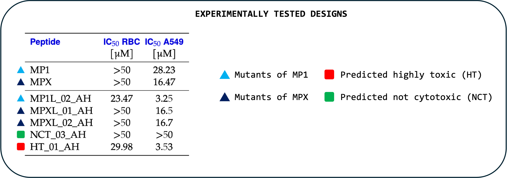

# ACP-designer

<p align="center">
  
  <br/><br/>
  
</p>

<p align="center">
  <strong>ML-powered toolbox for rapid design of Mastoparan-like anticancer peptides</strong>
</p>

<p align="center">
  Developed by <a href="https://vacha.ceitec.cz">Robert Vacha group</a> • CEITEC
</p>

**ACP-designer** is a machine learning-based toolkit designed to accelerate the development of novel peptide-based anticancer therapeutics.

The toolbox combines:

- lightweight **generative model**  
- **cytotoxicity prediction filter**  
- **physicochemical feasibility checks**

→ allowing fast generation and filtering of promising Mastoparan-like anticancer peptide candidates.

---

## ✨ Key Features

### 1. Generative Model

Small character-level RNN trained on known anticancer peptides and fine-tuned specifically on Mastoparan sequences.

<div align="center">
  
</div>

### 2. Cytotoxicity Filter

Classifier based on **ESM-2** protein language model embeddings + Random Forest regressor  
→ predicts probability of cytotoxicity. This probability is converted into three classes:

**Output labels:**
- **LOW**
- **MEDIUM**
- **HIGH**

<div align="center">
  
</div>

### 3. Additional Quality Filters

Comparison of generated sequences against training set distribution in:

- net charge
- hydrophobic moment

**Labels:**
- **OK** – good agreement with known sequences
- **EDGE** – significant deviation (may cause synthesis/solubility problems)

---

## Installation

### Local Installation

1. **Clone the Repository**  
   ```bash
   git clone https://github.com/karatedava/ACP-designer.git
   cd ACP-designer
   ```
2. **Install Miniconda**  
   Download and install Miniconda by following the [official Miniconda installation guide](https://www.anaconda.com/docs/getting-started/miniconda/install#quickstart-install-instructions).

3. **Create a Conda Environment**  
   Create and activate a Python 3.12 environment:
   ```bash
   conda create -n acp_designer python=3.12
   conda activate acp_designer
   ```
4. **Install Dependencies**  
   Install the required packages:
   ```bash
   pip install -r requirements.txt
   ```

### Web Application
No installation required! Access 'ACP-designer' full functionality via our web application:  
👉 **[Web App](https://peptide-predictor.cloud.e-infra.cz)**
Unfortunatelly only possible within Masaryk University intranet. Accessibility to the 'outside world' will be provided after security risks will be resolved

---

## Running ACP_designer (Local Installation)

**Generation of new ACPs**
   ```bash
   python run_cli.py --id 01 --nbatch 100
   ```

**Generation of new ACPs + mutation of desired sequence**
   ```bash
   python run_cli.py --id 01 --nbatch 100 --mutate INWKGIAAMAKKLL
   ```

### Command-Line Parameters
Customize runs with these parameters:

| Parameter       | Description                                              | Options/Default                     |
|-----------------|----------------------------------------------------------|-------------------------------------|
| `--id`   | run id to mark each run uniquely           | integer value, always required |
| `--nbatch`        | controls amount of generated peptides               | `100` (default)                     |
| `--device`      | device                              | `cpu` (default), `cuda`, `mps`             |
| `--mutate`          | sequnce to mutate                                  | string of amino acids, i.e: `KKWLKA...` |

---

## Success Story
We were able to design novel Mastoparan mutants with low hemolytic activity (RBC - red blood cell) and promising activity against human adenocarcinoma cells (A549):

<div align="center">
  
</div>

---

## Future Plans
*Work in progress!*  

